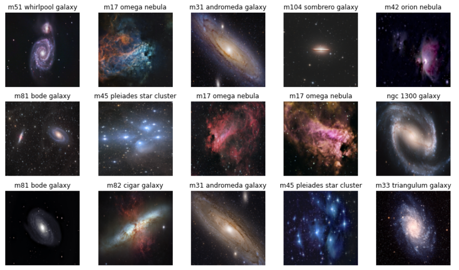
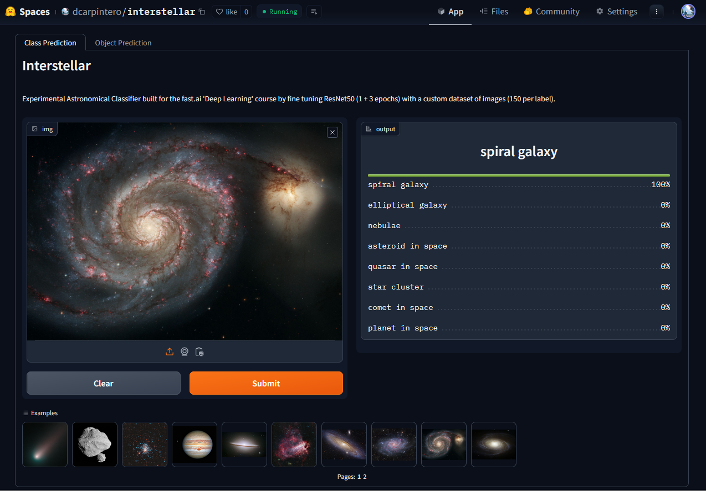
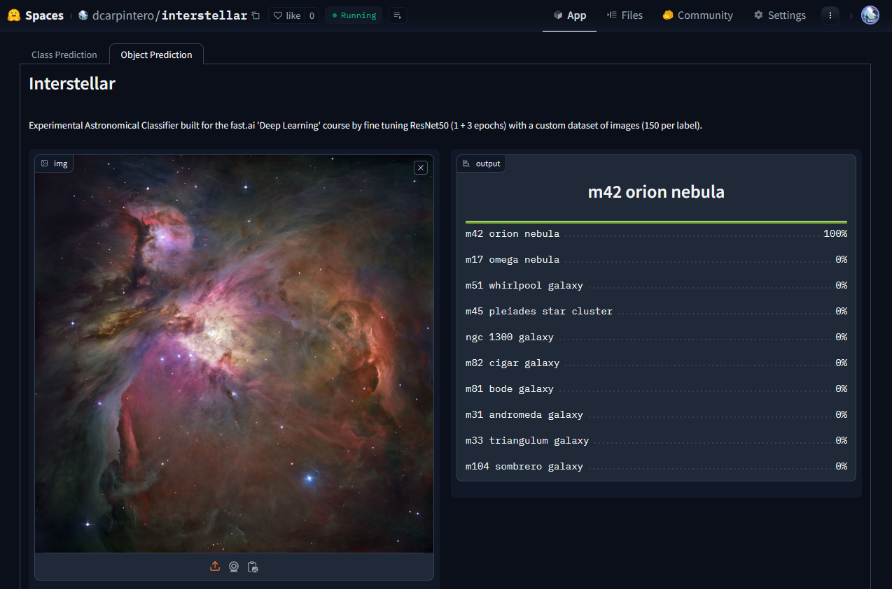

# Practical Deep Learning @ fast.ai

Learning notes and projects built for the Deep Learning course by [fast.ai](https://course.fast.ai/).

## 01. Bird Classifier

[[Notebook]](https://github.com/dcarpintero/fastai-deeplearning/blob/main/course2024/lesson_01.ipynb) 
[[Lesson Summary]](https://github.com/dcarpintero/fastai-deeplearning/blob/main/course2024/lesson_01.summary.md)

## 02. Interstellar (Astronomical Classifier)

[[Open in HuggingFace]](https://huggingface.co/spaces/dcarpintero/interstellar) 
[[Model]](https://huggingface.co/dcarpintero/fastai-interstellar-class)
[[Notebook]](https://github.com/dcarpintero/fastai-deeplearning/blob/main/course2024/lesson_02.ipynb) 
[[Lesson Summary]](https://github.com/dcarpintero/fastai-deeplearning/blob/main/course2024/lesson_02.summary.md)
[[Quiz]](https://github.com/dcarpintero/fastai-deeplearning/blob/main/course2024/lesson_02.quiz.md)

`[deep-learning]` `[data-augmentation]` `[ResNet-50]` `[transfer-learning]`

Visual learner to classify images of astronomical objects using ResNet and transfer learning (1 + 3 epochs). We provide two versions: `class model`, and `object model`.

In the `class model`, the possible labels are:
- galaxy
- nebula
- comet
- asteroid
- quasar, and 
- star cluster.

In the `object model` the labels are specific astronomy objects:
- m31 andromeda galaxy
- m33 triangulum galaxy
- m81 bode galaxy
- m82 cigar galaxy
- ngc 1300 galaxy
- m104 sombrero galaxy
- m51 whirlpool galaxy
- m42 orion nebula
- m17 omega nebula
- m45 pleiades star cluster

The datasets have been created using [Bing Search API](https://www.microsoft.com/en-us/bing/apis/bing-web-search-api).

  

The model reaches 84% accuracy on class level:

  

and 91% accuracy at object level:

  

## 03. Ethics

[[Lesson Summary]](https://github.com/dcarpintero/fastai-deeplearning/blob/main/course2024/lesson_03.summary.md)

## 04. Mnist Classifier

[[Lesson Summary]](https://github.com/dcarpintero/fastai-deeplearning/blob/main/course2024/lesson_04.summary.md)
