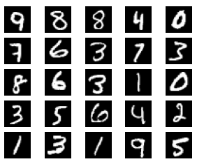

# Practical Deep Learning @ fast.ai

Learning notes and projects built for the Deep Learning course by [fast.ai](https://course.fast.ai/).

## 01. Getting Started - Bird Classifier

[Notebook](./course2024/lesson_01.ipynb) |
[Summary](./course2024/lesson_01.summary.md) |
[Quiz](./course2024/lesson_01.quiz.md)

## 02. Deployment - Astronomy Classifier

[Notebook](./course2024/lesson_02.astronomy.ipynb) |
[Summary](./course2024/lesson_01.summary.md) |
[Quiz](./course2024/lesson_02.quiz.md) |
[Model](https://huggingface.co/dcarpintero/fastai-interstellar-class) |
[Try in HuggingFace Spaces](https://huggingface.co/spaces/dcarpintero/interstellar) 

`[deep-learning]` `[data-augmentation]` `[ResNet-50]` `[transfer-learning]`

Visual learner to classify images of astronomical objects using ResNet and transfer learning (1 + 3 epochs). We provide two versions: `class model`, and `object model`.

In the `class model`, the possible labels are: `galaxy`, `nebula`, `comet`, `asteroid`, `quasar`, and `star cluster`.

In the `object model` the labels are specific astronomy objects: `m31 andromeda galaxy`, `m33 triangulum galaxy`, `m81 bode galaxy`, `m82 cigar galaxy`, `ngc 1300 galaxy`, `m104 sombrero galaxy`, `m51 whirlpool galaxy`, `m42 orion nebula`, `m17 omega nebula`, and `m45 pleiades star cluster`.

The datasets have been created using [Bing Search API](https://www.microsoft.com/en-us/bing/apis/bing-web-search-api), 150 images per class with augmentation.

  

The model reaches 84% accuracy on class level:

  

and 91% accuracy at object level:

  

## 03. Neural Net Foundations - Digit Classifier w/ Multi-Layer Perceptron

[Summary](./course2024/lesson_03.summary.md) |
[Quiz](./course2024/lesson_03.quiz.md) |
[Digit Classifier w/ Multi-Layer Perceptron](./course2024/lesson_03.full.mnist.mlp.ipynb)

`[deep-learning]` `[perceptron]` `[backpropagation]` `[gradient-descend]` `[linear-layer]` `[relu]` `[optimizer]` `[mnist]` `[multi-class]` `[universal-approximation-theorem]`

[Annotated Multi-Layer Perceptron](./course2024/lesson_03.full.mnist.mlp.md) trained on the MNIST dataset to classify handwritten digits. It  implements from scratch the following modules: **linear layer**, **relu-activation-function**, **sequential-layer**, **flatten-layer**, **basic optimizer**, and **learner**.

We define a hidden layer of size `128, 64` wherein the input tensors (28 x 28) are flattened in the height, and width dimensions into 1 dimension (784). The model achieves 90% accuracy with `10 training epochs` and a `batch size = 128`.

  

