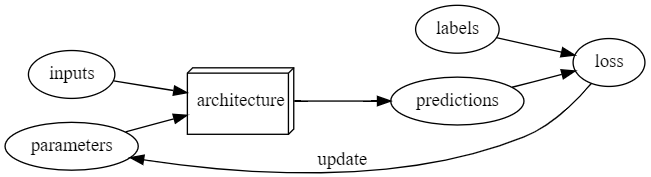

## Deep Learning

Deep learning is a computer technique to extract and transform data–-with use cases ranging from human speech recognition to animal imagery classification–-by using multiple layers of neural networks. Each of these layers takes its inputs from previous layers and progressively refines them. The layers are trained by algorithms that minimize their errors and improve their accuracy. In this way, the network learns to perform a specified task.

## Neural Networks: A Brief History

- In 1943, neurophysiologist `Warren McCulloch` and logician `Walter Pitts` developed a mathematical model of an artificial neuron. Their paper, "A Logical Calculus of the Ideas Immanent in Nervous Activity", proposed using propositional logic to describe neural events due to the "all-or-none" nature of nervous activity. McCulloch and Pitts' model represented neurons with simple addition and thresholding.
- Psychologist `Frank Rosenblatt` expanded on their work by developing the `perceptron, a device capable of learning and recognizing simple shapes`.
- Marvin Minsky and Seymour Papert critiqued the perceptron in their book "Perceptrons", pointing out its `inability to learn certain functions like XOR`, and suggested multi-layer networks could overcome this limitation.
- The global academic community largely abandoned NN research for two decades following Minsky and Papert's critique.
- In 1986, the book "Parallel Distributed Processing (PDP)" by David Rumelhart, James McClellan, and `the PDP Research Group revitalized interest in neural networks by proposing a model closely resembling brain computation`.
- PDP defined key components of neural networks, including `processing units`, `activation states`, and `learning rules`, aligning with modern neural network architecture.
- Despite early challenges, NN evolved in the 1980s and 1990s with multi-layer models, overcoming previous limitations.
- Recent advancements in computing power, data availability, and algorithmic improvements have finally realized the potential of neural networks, fulfilling Rosenblatt's vision of machines capable of perception and recognition without human intervention.

## Machine Learning

- In 1949, IBM researcher `Arthur Samuel coined the term machine learning`, focusing on `teaching computers to learn from examples rather than programming explicit` instructions. Samuel critiqued traditional programming for its tediousness and proposed machine learning as a solution, where computers learn to solve problems by themselves.
- By 1961, his checkers-playing program demonstrated the effectiveness of machine learning by beating the Connecticut state champion.
- Samuel introduced the concept of `weight assignments` in machine learning, where weights are variables that influence the program's operation and outcomes.
He emphasized the need for an `automatic method to test and optimize these weight assignments` based on their `performance in real tasks`.
- The modern terminology refers to what Samuel called "weights" as model parameters, with the term "weights" now denoting a specific type of parameter.
- Samuel envisioned machine learning as a process where the adjustment of weights is automated based on performance, making the learning process entirely automatic.

## Neural Networks

- Neural networks serve as a highly flexible model, capable of solving virtually any problem to any desired accuracy level, as demonstrated by the universal approximation theorem.
- The process of training neural networks, or finding optimal weight assignments, is facilitated by a method known as `stochastic gradient descent (SGD)`.
SGD offers a `general approach to automatically updating the weights of a neural network to improve its performance on any given task`.
- Neural networks align with Arthur Samuel's original vision for machine learning, offering a versatile solution for a broad range of problems through weight optimization.
- The effectiveness of weight assignments is measured by the model's accuracy in making correct predictions, aligning with Samuel's framework for evaluating performance.
- In the context of image classification, the inputs are images, the weights are the neural network's parameters, and the model's output could classify images.

## Limitations inherent to Machine Learning

- A model requires data to be created and `can only learn from the patterns present in the training data`. Many organizations lack sufficient labeled data, not just data in general. In fact, labeling data is a significant challenge, especially when existing data comes from processes not designed to produce structured datasets.
- The `learning process results in predictions`, not recommendations for actions. This may not align perfectly with organizational goals, such as recommendation systems suggesting products a user already knows about or has.
- Models can create `feedback loops, which can amplify biases`, lead to skewed outcomes, and affect commercial systems (e.g. video recommendation algorithms that may favor content preferred by pattern outliers).

## Practical Tips

- Labels in datasets are often denoted by the filename prefix, or most commonly the parent folder name.
- Training, Test, and Validation datasets.
- `Training for too long can lead to overfitting`, where a model memorizes the training data (or certain parts of it) instead of learning generalizable patterns. This results in high accuracy on the training set but poor performance on unseen data.
- Overfitting is a major challenge in machine learning, necessitating methods to prevent it (only use those methods after you have confirmed that overfitting is actually occurring) to ensure models perform well on new data.
- Models with `many layers` can be more accurate but are also `more prone to overfitting` and require more data and training time.
- `Metrics measure` the model's `prediction quality` on the validation set for human understanding, distinct from `loss functions` which are `used by the training system to update weights`.

## Pre-trained Models, Transfer Learning, Overfitting

- Pretrained models are models trained on a different dataset, which can significantly enhance the capability of your model before it even sees your data, due to their ability to perform common tasks.
- When adopting a pretrained model, it is common to remove the last layer, tailored to the original task. E.g., ImageNet classification is replaced with a new layer with randomized weights suitable for your dataset, known as the head.
- Utilizing `pretrained models is crucial for achieving higher accuracy`, speed, and efficiency in training models with less data and resources, despite its underrepresentation in academic studies and discussions.
- `Transfer learning` is the process of using a pretrained model for a task different from its original training purpose. However, the availability of pretrained models in specific fields, like medicine, is limited, and applying transfer learning to domains like time series analysis is not well-understood.
- `Fine-tuning is a transfer learning technique` where a pretrained model is adjusted to a new task by updating its parameters, often requiring the setting of epochs, or the number of complete passes through the dataset.
-  The architecture of a model only describes a template for a mathematical function; it doesn't actually do anything until we provide values for the millions of parameters it contains. 

> **This is the key to deep learning—determining how to fit the parameters of a model to get it to solve your problem. In order to fit a model, we have to provide at least one piece of information: how many times to look at each image (known as number of epochs)**. The number of epochs you select will largely depend on how much time you have available, and how long you find it takes in practice to fit your model. **If you select a number that is too small, you can always train for more epochs later**.

## Notes on Computer Vision

- Convolutional Neural Networks (CNNs) are the state-of-the-art for computer vision tasks, inspired by the human vision system.
- Choosing the right architecture, like ResNet, is less critical than often thought, with standard architectures usually sufficing for most tasks. The number in ResNet (e.g., 34, 50, 101, 152) refers to the number of layers.

## Deep Learning Vocabulary

- **Label**: The data we're trying to predict (e.g., "bird" or "").
- **Architecture**: The template of the model we're trying to fit; essentially, the mathematical function receiving input data and parameters.
- **Model**: The combination of architecture and a specific set of parameters.
- **Parameters**: Values within the model that determine its functionality and are adjusted during training.
- **Fit**: The process of updating the model's parameters so its predictions align with target labels.
- **Train**: Another term for "fit."
- **Pretrained Model**: A model already trained on a large dataset, ready for fine-tuning on a specific task.
- **Fine-tune**: Adjusting a pretrained model to perform a different, specific task.
- **Epoch**: One full cycle through the input data during training.
- **Loss**: A quantification of the model's performance, guiding training through stochastic gradient descent (SGD).
- **Metric**: A measure of the model's performance based on the validation set, intended for human interpretation.
- **Validation Set**: Data excluded from training, used to evaluate model performance.
- **Training Set**: The dataset used to fit the model, excluding any data from the validation set.
- **Overfitting**: A scenario where the model learns details from the training data too closely, hindering its ability to generalize to new data.
- **CNN**: Convolutional Neural Network, a type of neural network especially effective for computer vision tasks.

## Validation, and Test Sets

- Model Training and Validation: The model training process is fundamentally basic, and using the same data for training and evaluation can lead to poor performance on unseen data. To prevent this, data is split into a training set and a validation (or development) set.

- Avoiding "Cheating": The validation set ensures the model is learning generalizable characteristics rather than memorizing specific data items. This helps prevent the model from "cheating" by recognizing data it has seen during training.

- Hyperparameter Exploration: Real-world model development involves experimenting with various model versions, including changes in network architecture, learning rates, and data augmentation strategies. These are influenced by hyperparameters, or parameters about parameters.

- Overfitting the Validation Data: There's a risk of overfitting the validation data through human-led exploration and trial and error, similar to how models can overfit training data.

- Introducing the Test Set: To address potential overfitting to the validation set, an additional layer of data, the test set, is reserved for final model evaluation only, ensuring no direct or indirect influence on model development.

- Hierarchy of Data Exposure: There's a structured approach to data exposure in training and evaluation - training data is fully exposed, validation data is less exposed, and test data is completely hidden.

- Size of Test and Validation Sets: Both sets should be large enough to provide accurate estimates of model performance, with the specific size depending on the dataset's characteristics and the problem at hand.

- Necessity of a Test Set: While having both a test set and a validation set may seem excessive, it's crucial for maintaining objectivity about model performance and avoiding the simplest paths to prediction, like memorization.

- Importance for Decision Makers: Understanding the roles and importance of test and validation sets is key for senior decision-makers to avoid common pitfalls in AI and machine learning projects, ensuring external models or services are evaluated effectively against actual requirements.

## From the Authors

*Machine learning* is a discipline where we define a program not by writing it entirely ourselves, but by learning from data. *Deep learning* is a specialty within machine learning that uses *neural networks* with multiple *layers*. *Image classification* is a representative example (also known as *image recognition*). We start with *labeled data*; that is, a set of images where we have assigned a *label* to each image indicating what it represents. Our goal is to produce a program, called a *model*, which, given a new image, will make an accurate *prediction* regarding what that new image represents.

Every model starts with a choice of *architecture*, a general template for how that kind of model works internally. The process of *training* (or *fitting*) the model is the process of finding a set of *parameter values* (or *weights*) that specialize that general architecture into a model that works well for our particular kind of data. In order to define how well a model does on a single prediction, we need to define a *loss function*, which determines how we score a prediction as good or bad.

To make the training process go faster, we might start with a *pretrained model* — a model that has already been trained on someone else's data. We can then adapt it to our data by training it a bit more on our data, a process called *fine-tuning*.

When we train a model, a key concern is to ensure that our model *generalizes* — that is, that it learns general lessons from our data which also apply to new items it will encounter, so that it can make good predictions on those items. The risk is that if we train our model badly, instead of learning general lessons it effectively memorizes what it has already seen, and then it will make poor predictions about new images. Such a failure is called *overfitting*. In order to avoid this, we always divide our data into two parts, the *training set* and the *validation set*. We train the model by showing it only the training set and then we evaluate how well the model is doing by seeing how well it performs on items from the validation set. In this way, we check if the lessons the model learns from the training set are lessons that generalize to the validation set. In order for a person to assess how well the model is doing on the validation set overall, we define a *metric*. During the training process, when the model has seen every item in the training set, we call that an *epoch*.

## Papers / References

- In 2013 a PhD student, Matt Zeiler, and his supervisor, Rob Fergus, published the paper [Visualizing and Understanding Convolutional Networks](https://arxiv.org/pdf/1311.2901.pdf), which showed how to visualize the neural network weights learned in each layer of a model. They carefully analyzed the model that won the 2012 ImageNet competition, and used this analysis to greatly improve the model, such that they were able to go on to win the 2013 competition.
- https://rise.readthedocs.io/en/latest/ : Convert Notebooks to Presentations
- Blogging with Notebooks
- https://www.assemblyai.com/blog/pytorch-vs-tensorflow-in-2023/
- https://timm.fast.ai/